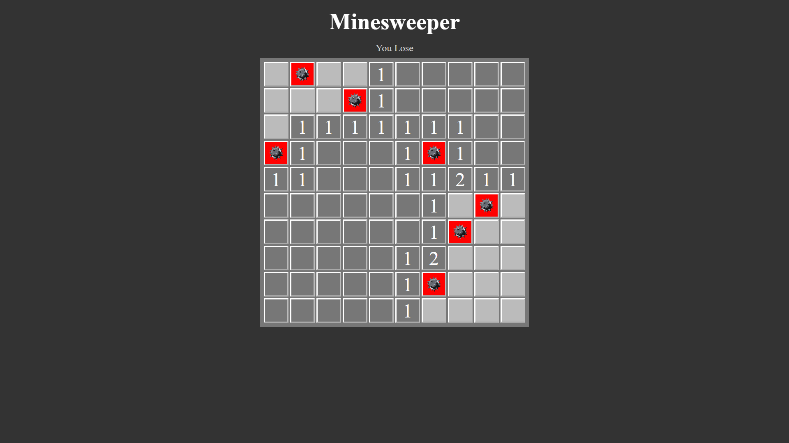

# Minesweeper-Clone
Reveal all the numbered tiles but avoiding the Mines!

<h2>Rules of the game</h2>
<ul>
  <li>Reveal all possible numbered tiles</li>
  <li>If you step on the mine then GAME OVER!</li>
  <li>Number on the each tile represents the number of tiles present in the 3x3 grid around it</li>
  <li>You can mark the tile with a 'right click' if you're sure that there is a Mine beneath that tile</li>
</ul>

<h2>Running it locally on your machine</h2>
Just simply clone the repo

<h2>Built With</h2>
<ul>
  <li>HTML</li>
  <li>CSS</li>
  <li>Javascript</li>
</ul>
<pre>
<h1>Screenshot</h1>

Here is the screenshot :-

</pre>
